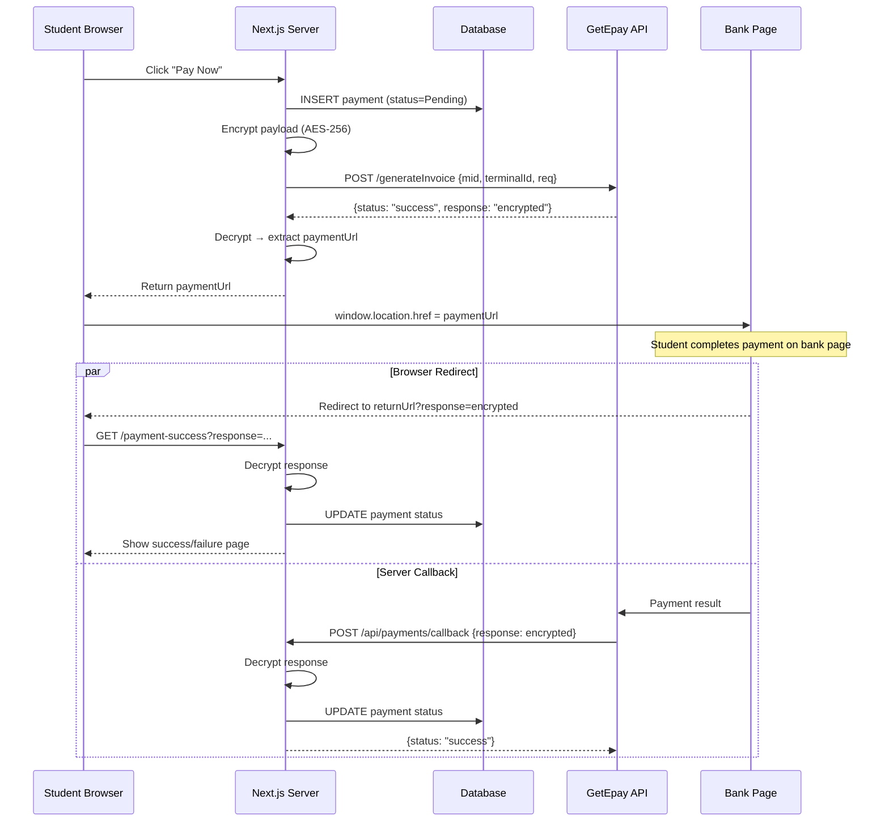

# GetEpay Payment Gateway — Integration Guide

> **Purpose:** This document is a complete, self-contained reference for integrating the GetEpay payment gateway into a Next.js (App Router) + Drizzle ORM project. Follow it step-by-step whenever you need to build a new payment module.

---

## Table of Contents

1. [Architecture Overview](#1-architecture-overview)
2. [Prerequisites](#2-prerequisites)
3. [Environment Variables](#3-environment-variables)
4. [Database Schema](#4-database-schema)
5. [Encryption Utility (AES-256)](#5-encryption-utility-aes-256)
6. [Server Actions](#6-server-actions)
   - 6.1 [Fetch Payment Details](#61-fetch-payment-details)
   - 6.2 [Initiate Payment (Generate Invoice)](#62-initiate-payment-generate-invoice)
   - 6.3 [Process Browser Return](#63-process-browser-return)
7. [Webhook Callback Route (Server-to-Server)](#7-webhook-callback-route-server-to-server)
8. [Client-Side Checkout UI](#8-client-side-checkout-ui)
9. [Payment Success / Failure Landing Page](#9-payment-success--failure-landing-page)
10. [Developer Sandbox Bypass (Mock Checkout)](#10-developer-sandbox-bypass-mock-checkout)
11. [Printable Receipt & Application](#11-printable-receipt--application)
12. [Complete Flow Diagram](#12-complete-flow-diagram)
13. [Production Checklist](#13-production-checklist)
14. [Troubleshooting & FAQ](#14-troubleshooting--faq)

---

## 1. Architecture Overview

GetEpay uses an **encrypted redirect** model with two response channels:

```
┌──────────────┐         ┌──────────────┐         ┌──────────────┐
│  Your Server │──POST──▶│  GetEpay API  │──▶ HTML │  Bank Page   │
│  (Generate   │         │ /generateInv  │  ◀──────│  (Card/UPI)  │
│   Invoice)   │◀────────│  Returns URL  │         └──────┬───────┘
└──────────────┘         └──────────────┘                 │
                                                          │ Payment result
                         ┌────────────────────────────────┘
                         ▼
            ┌─────────────────────────────┐
            │  Two response channels:     │
            │                             │
            │  1. Browser Redirect (GET)  │──▶ /payment-success?response=...
            │     (User's browser)        │
            │                             │
            │  2. Server Callback (POST)  │──▶ /api/payments/callback
            │     (GetEpay server)        │
            └─────────────────────────────┘
```

**Key concept:** Both channels carry an AES-encrypted JSON payload. You must decrypt it, verify the merchant ID, check the amount, and update your database. Both channels are needed because the browser redirect may fail (user closes tab) but the server callback is reliable.

---

## 2. Prerequisites

| Dependency | Purpose |
|---|---|
| `next` (App Router) | Framework |
| `drizzle-orm` + `drizzle-kit` | Database ORM |
| `@paralleldrive/cuid2` | Unique ID generation for payment records |
| Node.js `crypto` module | AES encryption/decryption (built-in, no install needed) |

GetEpay provides you with **4 credentials** upon merchant registration:

| Credential | Example |
|---|---|
| **MID** (Merchant ID) | `108` |
| **Terminal ID** | `Getepay.merchant61062@icici` |
| **Encryption Key** (Base64) | `JoYPd+qso9s7T+Ebj8pi4Wl8i+AHLv+5UNJxA3JkDgY=` |
| **Encryption IV** (Base64) | `hlnuyA9b4YxDq6oJSZFl8g==` |

---

## 3. Environment Variables

Add these to your `.env` file:

```env
# ─── GetEpay Payment Gateway ────────────────────────────────
GETEPAY_MID=108
GETEPAY_TERMINAL_ID=Getepay.merchant61062@icici
GETEPAY_KEY=JoYPd+qso9s7T+Ebj8pi4Wl8i+AHLv+5UNJxA3JkDgY=
GETEPAY_IV=hlnuyA9b4YxDq6oJSZFl8g==
GETEPAY_URL=https://pay1.getepay.in:8443/getepayPortal/pg/v2/generateInvoice

# ─── URLs (change in production) ────────────────────────────
NEXT_PUBLIC_APP_URL=http://localhost:3000
GETEPAY_RETURN_URL=http://localhost:3000/payment-success
GETEPAY_CALLBACK_URL=http://localhost:3000/api/payments/callback
```

> **⚠️ Production:** Replace `localhost:3000` with your deployed domain (must be HTTPS). GetEpay will reject non-HTTPS callback URLs in production.

---

## 4. Database Schema

You need a table to track every payment attempt. Here is the Drizzle ORM schema:

```typescript
// lib/db/schema/student.ts (or payments.ts)

import { pgTable, varchar, integer, timestamp } from "drizzle-orm/pg-core";
import { createId } from "@paralleldrive/cuid2";

export const StudentFeePaymentTable = pgTable("student_fee_payment", {
  id: varchar({ length: 128 })
    .primaryKey()
    .$defaultFn(() => createId()),

  // Link to the user/student who is paying
  studentId: varchar({ length: 128 })
    .references(() => YourUserTable.id, { onDelete: "cascade" })
    .notNull(),

  // Metadata
  semesterCount: integer().notNull(),           // Which semester this payment is for
  amount: integer().notNull().default(0),       // Total amount in INR (paise-free integer)
  paymentMode: varchar({ length: 30 })
    .notNull().default("UPI"),                  // Online, UPI, Card, etc.
  transactionId: varchar({ length: 255 })
    .notNull(),                                 // Your generated TXN ID or bank TXN ID
  status: varchar({ length: 30 })
    .notNull().default("Pending"),              // "Pending" | "Success" | "Failed"

  createdAt: timestamp().defaultNow().notNull(),
  updatedAt: timestamp().defaultNow().notNull(),
});
```

**Status lifecycle:**

```
  Pending ──────────▶ Success   (payment confirmed)
     │
     └──────────────▶ Failed    (payment rejected / timeout / amount mismatch)
```

Run your migration after adding the schema:

```bash
npx drizzle-kit push
# or
npx drizzle-kit generate && npx drizzle-kit migrate
```

---

## 5. Encryption Utility (AES-256)

GetEpay uses **two different encryption modes** depending on the environment:

| Environment | Algorithm | Key Derivation |
|---|---|---|
| **UAT / Sandbox** | AES-256-GCM | PBKDF2 from SHA-256 hash of `Key + IV` |
| **Production** | AES-256-CBC | Direct Base64 decode of Key and IV |

Create `lib/getepay-encrypt.ts`:

```typescript
import crypto from "crypto";

export class GcmPgEncryption {
  private iv: string;
  private key: string;
  private isProduction: boolean;
  private md5Iv: string | null = null;

  constructor(iv: string, key: string, isProduction = false) {
    this.iv = iv;
    this.key = key;
    this.isProduction = isProduction;

    // In production, if IV is not valid Base64 (e.g. it's the Terminal ID string),
    // use MD5 hash of the Terminal ID as the IV bytes.
    if (isProduction && !this._isValidBase64(iv)) {
      this.md5Iv = crypto.createHash("md5").update(iv).digest("hex");
    }
  }

  private _isValidBase64(str: string): boolean {
    try {
      const buffer = Buffer.from(str, "base64");
      return Buffer.from(buffer).toString("base64") === str;
    } catch {
      return false;
    }
  }

  async encrypt(plainText: string): Promise<string> {
    return this.isProduction
      ? this._encryptCBC(plainText)
      : this._encryptGCM(plainText);
  }

  async decrypt(cipherText: string): Promise<string> {
    return this.isProduction
      ? this._decryptCBC(cipherText)
      : this._decryptGCM(cipherText);
  }

  // ─── PRODUCTION: AES-256-CBC ──────────────────────────────

  private _encryptCBC(plainText: string): string {
    const iv = this.md5Iv
      ? Buffer.from(this.md5Iv, "hex")
      : Buffer.from(this.iv, "base64");
    const key = Buffer.from(this.key, "base64");

    const cipher = crypto.createCipheriv("aes-256-cbc", key, iv);
    cipher.setAutoPadding(true);

    let encrypted = cipher.update(plainText, "utf8", "hex");
    encrypted += cipher.final("hex");
    return encrypted.toUpperCase();
  }

  private _decryptCBC(cipherText: string): string {
    const iv = this.md5Iv
      ? Buffer.from(this.md5Iv, "hex")
      : Buffer.from(this.iv, "base64");
    const key = Buffer.from(this.key, "base64");

    const decipher = crypto.createDecipheriv("aes-256-cbc", key, iv);
    decipher.setAutoPadding(true);

    let decrypted = decipher.update(cipherText, "hex", "utf8");
    decrypted += decipher.final("utf8");
    return decrypted;
  }

  // ─── SANDBOX: AES-256-GCM ────────────────────────────────

  private async _encryptGCM(plainText: string): Promise<string> {
    // Step 1: Derive master key from SHA-256(Key + IV)
    const combined = this.key + this.iv;
    const hash = crypto.createHash("sha256").update(combined).digest();
    const mKey = hash.toString("base64");

    // Step 2: Random salt (16 bytes) + random IV (12 bytes)
    const salt = crypto.randomBytes(16);
    const iv = crypto.randomBytes(12);

    // Step 3: PBKDF2 key derivation
    const derivedKey = crypto.pbkdf2Sync(mKey, salt, 65535, 32, "sha512");

    // Step 4: Encrypt
    const cipher = crypto.createCipheriv("aes-256-gcm", derivedKey, iv);
    const encrypted = Buffer.concat([
      cipher.update(plainText, "utf8"),
      cipher.final(),
    ]);
    const tag = cipher.getAuthTag();

    // Step 5: Concatenate → salt(16) + iv(12) + ciphertext + tag(16)
    return Buffer.concat([salt, iv, encrypted, tag]).toString("base64");
  }

  private async _decryptGCM(cipherText: string): Promise<string> {
    const combined = this.key + this.iv;
    const hash = crypto.createHash("sha256").update(combined).digest();
    const mKey = hash.toString("base64");

    const data = Buffer.from(cipherText, "base64");
    const salt = data.subarray(0, 16);
    const iv = data.subarray(16, 28);
    const tag = data.subarray(data.length - 16);
    const encrypted = data.subarray(28, data.length - 16);

    const derivedKey = crypto.pbkdf2Sync(mKey, salt, 65535, 32, "sha512");

    const decipher = crypto.createDecipheriv("aes-256-gcm", derivedKey, iv);
    decipher.setAuthTag(tag);

    let decrypted = decipher.update(encrypted).toString("utf8");
    decrypted += decipher.final("utf8");
    return decrypted;
  }
}
```

### Usage

```typescript
const isProduction = process.env.NODE_ENV === "production";
const encryptor = new GcmPgEncryption(
  process.env.GETEPAY_IV!,
  process.env.GETEPAY_KEY!,
  isProduction,
);

// Encrypt a JSON payload
const ciphertext = await encryptor.encrypt(JSON.stringify(payload));

// Decrypt a response
const plaintext = await encryptor.decrypt(ciphertext);
const parsed = JSON.parse(plaintext);
```

---

## 6. Server Actions

All payment logic runs as Next.js Server Actions (`"use server"`) so secrets never reach the browser.

### 6.1 Fetch Payment Details

Before showing the checkout page, query the database to calculate fees and check for existing payments:

```typescript
"use server";

import { db } from "@/lib/db";
import { StudentFeePaymentTable } from "@/lib/db/schema/student";
import { eq, and } from "drizzle-orm";

export async function getStudentPaymentDetails(params: {
  studentId: string;
}) {
  const { studentId } = params;

  // 1. Fetch user/student record
  const student = await db.query.YourUserTable.findFirst({
    where: eq(YourUserTable.id, studentId),
  });
  if (!student) return { success: false, message: "Student not found." };

  // 2. Check if already paid
  const existingPayment = await db.query.StudentFeePaymentTable.findFirst({
    where: and(
      eq(StudentFeePaymentTable.studentId, student.id),
      eq(StudentFeePaymentTable.status, "Success"),
    ),
  });

  if (existingPayment) {
    return { success: true, isAlreadyPaid: true, student, payment: existingPayment };
  }

  // 3. Calculate fees (your business logic)
  const tuitionFee = 5000;
  const practicalFee = hasPracticalSubjects ? 600 : 0;
  const lateFee = isPastDeadline ? 200 : 0;
  const totalAmount = tuitionFee + practicalFee + lateFee;

  return {
    success: true,
    isAlreadyPaid: false,
    student,
    fees: { tuitionFee, practicalFee, lateFee, totalAmount },
  };
}
```

### 6.2 Initiate Payment (Generate Invoice)

This is the **core step** — it creates a pending record, encrypts the payload, POSTs to GetEpay, and returns the payment URL.

```typescript
"use server";

import { GcmPgEncryption } from "@/lib/getepay-encrypt";
import { createId } from "@paralleldrive/cuid2";

export async function initiatePayment(params: {
  studentId: string;
  totalAmount: number;
  studentName: string;
  studentEmail: string;
  studentPhone: string;
}) {
  const { studentId, totalAmount, studentName, studentEmail, studentPhone } = params;

  // ─── Step 1: Read environment variables ────────────────────
  const mid         = process.env.GETEPAY_MID!;
  const terminalId  = process.env.GETEPAY_TERMINAL_ID!;
  const getepayKey  = process.env.GETEPAY_KEY!;
  const getepayIv   = process.env.GETEPAY_IV!;
  const getepayUrl  = process.env.GETEPAY_URL!;
  const returnUrl   = process.env.GETEPAY_RETURN_URL!;
  const callbackUrl = process.env.GETEPAY_CALLBACK_URL!;

  // ─── Step 2: Generate unique IDs ───────────────────────────
  const paymentId = createId();  // CUID2 — stored as our primary key
  const txnId = `TXN-${Date.now()}-${Math.floor(100 + Math.random() * 900)}`;

  // ─── Step 3: Insert "Pending" record in database ──────────
  await db.insert(StudentFeePaymentTable).values({
    id: paymentId,
    studentId,
    semesterCount: 1,
    amount: totalAmount,
    paymentMode: "Online",
    transactionId: txnId,
    status: "Pending",
  });

  // ─── Step 4: Build GetEpay payload ─────────────────────────
  //
  // IMPORTANT FIELDS:
  //   mid              → Your merchant ID
  //   terminalId       → Your terminal ID
  //   amount           → String with 2 decimal places "5600.00"
  //   merchantOrderNo  → YOUR internal payment ID (returned in callbacks)
  //   ru               → Return URL (browser redirect after payment)
  //   callbackUrl      → Webhook URL (server-to-server notification)
  //
  const payload = {
    mid:                    mid.trim(),
    terminalId:             terminalId.trim(),
    amount:                 totalAmount.toFixed(2),
    merchantTransactionId:  txnId,
    merchantOrderNo:        paymentId,     // ← GetEpay returns this in callbacks
    transactionDate:        new Date().toISOString(),
    ru:                     `${returnUrl}?paymentId=${paymentId}`,
    callbackUrl:            `${callbackUrl}?paymentId=${paymentId}`,
    currency:               "INR",
    paymentMode:            "ALL",         // ALL = Card + UPI + Net Banking
    bankId:                 "455",
    txnType:                "single",
    productType:            "IPG",
    txnNote:                `Payment for ${studentName}`,
    udf1:                   studentPhone,  // User-defined fields (optional)
    udf2:                   studentEmail,
    udf3:                   studentName,
    udf4: "", udf5: "", udf6: "", udf7: "", udf8: "", udf9: "", udf10: "",
  };

  // ─── Step 5: Encrypt the payload ───────────────────────────
  const isProduction = process.env.NODE_ENV === "production";
  const encryptor = new GcmPgEncryption(getepayIv, getepayKey, isProduction);
  const ciphertext = await encryptor.encrypt(JSON.stringify(payload));

  // ─── Step 6: POST to GetEpay generateInvoice API ──────────
  const response = await fetch(getepayUrl, {
    method: "POST",
    headers: { "Content-Type": "application/json" },
    body: JSON.stringify({
      mid: mid.trim(),
      terminalId: terminalId.trim(),
      req: ciphertext,
    }),
  });

  if (!response.ok) {
    throw new Error(`GetEpay returned HTTP ${response.status}`);
  }

  const resJson = await response.json();

  // ─── Step 7: Decrypt response and extract paymentUrl ───────
  //
  // GetEpay response shape:
  //   { status: "success", response: "<encrypted-string>" }
  //
  // Decrypted response shape:
  //   { status: "success", paymentUrl: "https://pay1.getepay.in/..." }
  //
  if (resJson?.status === "success" && resJson.response) {
    const decryptedText = await encryptor.decrypt(resJson.response);
    const decrypted = JSON.parse(decryptedText);

    if (decrypted.status === "success" && decrypted.paymentUrl) {
      return { success: true, paymentUrl: decrypted.paymentUrl, paymentId };
    }
  }

  return { success: false, message: resJson.message || "Invoice generation failed." };
}
```

### 6.3 Process Browser Return

When GetEpay redirects the user's browser back to your `returnUrl`, it appends an encrypted `response` query parameter. Decrypt and update the database:

```typescript
"use server";

export async function processPaymentReturn(responseCiphertext: string) {
  const encryptor = new GcmPgEncryption(
    process.env.GETEPAY_IV!,
    process.env.GETEPAY_KEY!,
    process.env.NODE_ENV === "production",
  );

  const decryptedText = await encryptor.decrypt(responseCiphertext);
  const decrypted = JSON.parse(decryptedText);

  // ─── Validate merchant ID ─────────────────────────────────
  const configuredMid = process.env.GETEPAY_MID!.trim();
  const responseMid = decrypted?.mid || "";
  if (responseMid && responseMid.trim() !== configuredMid) {
    throw new Error("Merchant ID mismatch — possible tampering.");
  }

  // ─── Extract key fields ────────────────────────────────────
  //
  // GetEpay callback payload fields:
  //   merchantOrderNo   → Your paymentId
  //   txnStatus         → "SUCCESS" or "FAILED"
  //   getepayTxnId      → Bank transaction reference
  //   txnAmount         → Amount string "5600.00"
  //   paymentMode       → "Online", "UPI", "Card", etc.
  //
  const paymentId  = decrypted.merchantOrderNo;
  const txnStatus  = String(decrypted.txnStatus || "").trim().toUpperCase();
  const bankTxnNo  = decrypted.getepayTxnId || null;
  const isSuccess  = txnStatus === "SUCCESS";
  const status     = isSuccess ? "Success" : "Failed";

  // ─── Update database ──────────────────────────────────────
  await db
    .update(StudentFeePaymentTable)
    .set({
      status,
      paymentMode: decrypted.paymentMode || "Online",
      transactionId: bankTxnNo || undefined,
      updatedAt: new Date(),
    })
    .where(eq(StudentFeePaymentTable.id, paymentId));

  return { success: true, paymentId, status };
}
```

---

## 7. Webhook Callback Route (Server-to-Server)

Create `app/api/payments/callback/route.ts`. This handles the **server-to-server POST** from GetEpay — it fires independently of the browser redirect and is your **most reliable** payment confirmation channel.

```typescript
// app/api/payments/callback/route.ts

import { NextResponse } from "next/server";
import { db } from "@/lib/db";
import { StudentFeePaymentTable } from "@/lib/db/schema/student";
import { GcmPgEncryption } from "@/lib/getepay-encrypt";
import { eq } from "drizzle-orm";

export async function POST(req: Request) {
  try {
    const url = new URL(req.url);
    let paymentId = url.searchParams.get("paymentId");

    // ─── Parse body (JSON or FormData) ───────────────────────
    let body: any = {};
    try {
      body = await req.json();
    } catch {
      try {
        const formData = await req.formData();
        body = Object.fromEntries(formData.entries());
      } catch { /* empty body */ }
    }

    // ─── Extract encrypted response ──────────────────────────
    const rawResponse = body.response || body.resp
      || url.searchParams.get("response") || url.searchParams.get("resp");

    if (!rawResponse) {
      return NextResponse.json(
        { status: "error", message: "Missing response payload" },
        { status: 400 },
      );
    }

    // Fix spaces that may have replaced + signs during URL transit
    const cipherText = String(rawResponse).trim().replace(/ /g, "+");

    // ─── Decrypt ─────────────────────────────────────────────
    const isProduction = process.env.NODE_ENV === "production";
    const encryptor = new GcmPgEncryption(
      process.env.GETEPAY_IV!, process.env.GETEPAY_KEY!, isProduction,
    );
    const decrypted = JSON.parse(await encryptor.decrypt(cipherText));

    // ─── Resolve paymentId ───────────────────────────────────
    if (!paymentId) paymentId = decrypted.merchantOrderNo;
    if (!paymentId) throw new Error("Missing paymentId in callback.");

    // ─── Fetch existing payment record ───────────────────────
    const existing = await db.query.StudentFeePaymentTable.findFirst({
      where: eq(StudentFeePaymentTable.id, paymentId),
    });
    if (!existing) throw new Error(`Payment ${paymentId} not found.`);

    // ─── Verify amount ───────────────────────────────────────
    const txnStatus = String(decrypted.txnStatus || "").trim().toUpperCase();
    const txnAmount = decrypted.txnAmount || decrypted.totalAmount || null;

    if (txnStatus === "SUCCESS" && txnAmount !== null) {
      const expected = Number(existing.amount);
      const received = Number(String(txnAmount).replace(/,/g, ""));
      if (Math.abs(expected - received) > 0.01) {
        await db.update(StudentFeePaymentTable)
          .set({ status: "Failed", updatedAt: new Date() })
          .where(eq(StudentFeePaymentTable.id, paymentId));
        return NextResponse.json(
          { status: "error", message: "Amount mismatch" },
          { status: 400 },
        );
      }
    }

    // ─── Update payment status ───────────────────────────────
    const isSuccess = txnStatus === "SUCCESS";
    await db.update(StudentFeePaymentTable)
      .set({
        status: isSuccess ? "Success" : "Failed",
        paymentMode: decrypted.paymentMode || "Online",
        transactionId: decrypted.getepayTxnId || existing.transactionId,
        updatedAt: new Date(),
      })
      .where(eq(StudentFeePaymentTable.id, paymentId));

    // ─── Post-success logic (mark fee as paid, etc.) ─────────
    if (isSuccess) {
      // Update your user record, send email, etc.
    }

    return NextResponse.json({ status: "success", message: "Callback processed" });
  } catch (error: any) {
    console.error("[Callback API] Error:", error);
    return NextResponse.json(
      { status: "error", message: error.message },
      { status: 500 },
    );
  }
}
```

### Important Notes on the Callback

- **Idempotency:** Both the browser redirect and webhook may update the same record. The second write is harmless (same status value).
- **`+ / space` issue:** URL-encoded Base64 can have `+` replaced by spaces during HTTP transit. Always do `.replace(/ /g, "+")` before decrypting.
- **Body format:** GetEpay may send JSON or URL-encoded form data. Parse both.

---

## 8. Client-Side Checkout UI

The checkout page is a **Server Component** that fetches fee details, and a **Client Component** that initiates the payment on button click.

### Server Component (Page)

```typescript
// app/payment/page.tsx

import { getStudentPaymentDetails } from "./lib/action";
import { PaymentContainer } from "./_components/payment-container";

export default async function PaymentPage({ searchParams }: {
  searchParams: Promise<{ studentId?: string; error?: string }>;
}) {
  const params = await searchParams;
  const res = await getStudentPaymentDetails({ studentId: params.studentId! });

  const initialError = params.error === "payment_failed"
    ? "Payment failed. Please retry."
    : null;

  if (res.success && res.student) {
    return (
      <PaymentContainer
        student={res.student}
        fees={res.fees}
        isAlreadyPaid={res.isAlreadyPaid}
        initialError={initialError}
      />
    );
  }

  return <div>Error: {res.message}</div>;
}
```

### Client Component (Container)

```typescript
// app/payment/_components/payment-container.tsx
"use client";

import { useState } from "react";
import { initiatePayment } from "../lib/action";

export function PaymentContainer({ student, fees, isAlreadyPaid, initialError }) {
  const [loading, setLoading] = useState(false);
  const [error, setError] = useState(initialError);

  const handlePay = async () => {
    setLoading(true);
    setError(null);

    const res = await initiatePayment({
      studentId: student.id,
      totalAmount: fees.totalAmount,
      studentName: student.name,
      studentEmail: student.email,
      studentPhone: student.phone,
    });

    if (res.success && res.paymentUrl) {
      // ★ Redirect the browser to the GetEpay payment portal
      window.location.href = res.paymentUrl;
    } else {
      setError(res.message || "Payment initiation failed.");
      setLoading(false);
    }
  };

  if (isAlreadyPaid) {
    return <div>Payment already completed!</div>;
  }

  return (
    <div>
      {error && <div className="text-red-600">{error}</div>}

      {/* Display fee breakdown table */}
      <div>Tuition: ₹{fees.tuitionFee}</div>
      <div>Practical: ₹{fees.practicalFee}</div>
      <div>Late Fee: ₹{fees.lateFee}</div>
      <div>Total: ₹{fees.totalAmount}</div>

      <button onClick={handlePay} disabled={loading}>
        {loading ? "Redirecting..." : "Pay Now"}
      </button>
    </div>
  );
}
```

**What happens on click:**
1. Server Action creates a "Pending" DB record.
2. Server Action encrypts payload and POSTs to GetEpay.
3. GetEpay returns an encrypted response containing `paymentUrl`.
4. Client-side `window.location.href` redirects the user's browser to the bank's payment page.

---

## 9. Payment Success / Failure Landing Page

After payment, GetEpay redirects the browser to your `returnUrl` with an encrypted `response` query param:

```
https://yoursite.com/payment-success?response=<encrypted-base64>&paymentId=<your-id>
```

### Server Component

```typescript
// app/payment-success/page.tsx

import { processPaymentReturn } from "@/app/payment/lib/action";
import { db } from "@/lib/db";
import { StudentFeePaymentTable } from "@/lib/db/schema/student";
import { eq } from "drizzle-orm";
import { redirect } from "next/navigation";

export default async function PaymentSuccessPage({ searchParams }) {
  const params = await searchParams;
  const response = params.response as string | undefined;

  let paymentResult = null;
  let lookupPaymentId: string | null = null;

  // ─── Channel 1: Decrypt browser redirect response ─────────
  if (response) {
    const res = await processPaymentReturn(response);
    if (res.success) lookupPaymentId = res.paymentId;
  }
  // ─── Channel 2: Fallback to DB lookup by paymentId ─────────
  else if (params.paymentId) {
    lookupPaymentId = params.paymentId as string;
  }

  // ─── Fetch payment + student from DB ───────────────────────
  if (lookupPaymentId) {
    const payment = await db.query.StudentFeePaymentTable.findFirst({
      where: eq(StudentFeePaymentTable.id, lookupPaymentId),
      with: { student: true },
    });

    if (payment) {
      paymentResult = {
        paymentId: payment.id,
        status: payment.status,
        amount: Number(payment.amount),
        txnId: payment.transactionId,
      };

      // ★ If FAILED → redirect back to checkout page to retry
      if (payment.status === "Failed" && payment.student) {
        redirect(
          `/payment?studentId=${payment.student.id}&error=payment_failed`
        );
      }
    }
  }

  // ─── Render success UI with print buttons ──────────────────
  return (
    <div>
      <h1>Payment Successful!</h1>
      <p>Amount: ₹{paymentResult?.amount}</p>
      <p>Transaction: {paymentResult?.txnId}</p>

      <a href={`/print/receipt?paymentId=${paymentResult?.paymentId}`}
         target="_blank">
        Print Payment Receipt
      </a>

      <a href={`/print/application?studentId=${student.id}`}
         target="_blank">
        Print Application
      </a>
    </div>
  );
}
```

### Key Design Decisions

| Scenario | Behaviour |
|---|---|
| Payment **Success** | Show thank you message + print buttons |
| Payment **Failed** | Auto-redirect back to checkout page with `error=payment_failed` |
| No `response` param but `paymentId` exists | Lookup from DB (handles mock checkout flow) |
| No params at all | Show generic error message |

---

## 10. Developer Sandbox Bypass (Mock Checkout)

GetEpay's UAT sandbox can be unreliable. In development, if the API fails, auto-redirect to a local mock checkout page:

```typescript
// Inside initiatePayment(), after GetEpay API call fails:

if (process.env.NODE_ENV !== "production") {
  return {
    success: true,
    paymentUrl: `/payment/mock-checkout?paymentId=${paymentId}`,
    isMock: true,
  };
}
```

The mock page provides "Simulate Success" and "Simulate Failure" buttons that:
1. Build a mock GetEpay response payload.
2. Encrypt it with the same encryption utility.
3. POST it to your own `/api/payments/callback` endpoint.
4. Redirect to `/payment-success?paymentId=...`.

This lets you test the **entire flow** without the real gateway being online.

---

## 11. Printable Receipt & Application

Create dedicated print pages that auto-trigger `window.print()`:

### Auto-Print Trigger Component

```typescript
// _components/printer-trigger.tsx
"use client";

import { useEffect } from "react";

export function PrinterTrigger({ delayMs = 500 }: { delayMs?: number }) {
  useEffect(() => {
    const timer = setTimeout(() => window.print(), delayMs);
    return () => clearTimeout(timer);
  }, [delayMs]);

  return null;
}
```

### Receipt Page Pattern

```typescript
// app/print/receipt/page.tsx (Server Component)

export default async function PrintableReceipt({ searchParams }) {
  const params = await searchParams;
  const paymentId = params.paymentId as string;

  // Query payment + student + batch from database
  const payment = await db.query.StudentFeePaymentTable.findFirst({
    where: eq(StudentFeePaymentTable.id, paymentId),
    with: { student: true },
  });

  return (
    <div className="max-w-4xl mx-auto p-8 bg-white">
      <PrinterTrigger delayMs={500} />

      {/* College letterhead */}
      <h1>College Name</h1>
      <h2>Fee Payment Receipt</h2>

      {/* Student details grid */}
      <div>Name: {payment.student.name}</div>
      <div>UAN: {payment.student.UAN}</div>

      {/* Transaction table */}
      <div>Transaction ID: {payment.transactionId}</div>
      <div>Amount: ₹{payment.amount}</div>
      <div>Status: CONFIRMED</div>

      {/* Fee breakup table */}
      {/* ... */}

      {/* Signature & seal area */}
    </div>
  );
}
```

### Application Page Pattern

Same approach — query full student record with relations (`previousAcademicRecord`, `documents`) and render a formal admission form with photo, personal info, subject choices, academic record, and signature.

---

## 12. Complete Flow Diagram



---

## 13. Production Checklist

- [ ] **HTTPS only** — GetEpay rejects HTTP callback URLs in production.
- [ ] **Update `.env`** — Replace all `localhost:3000` with your production domain.
- [ ] **Verify encryption mode** — Production uses AES-256-**CBC**; sandbox uses AES-256-**GCM**. The `GcmPgEncryption` class handles this automatically via `process.env.NODE_ENV`.
- [ ] **Remove mock checkout** — The sandbox bypass should not be accessible in production (`process.env.NODE_ENV !== "production"` guard is already in place).
- [ ] **Verify Merchant ID** — Always check that the `mid` in the decrypted response matches your configured `GETEPAY_MID` to prevent cross-merchant tampering.
- [ ] **Amount verification** — Always compare the `txnAmount` in the callback against your database record. Mark as "Failed" on mismatch.
- [ ] **Idempotent updates** — Both the browser redirect and webhook callback update the same record. Design your DB writes to be safe when called twice.
- [ ] **Logging** — Log all decrypted payloads in production for audit trails and dispute resolution.

---

## 14. Troubleshooting & FAQ

### "Unable to process payment request" from GetEpay sandbox

The UAT sandbox (`pay1.getepay.in`) is frequently down or unresponsive. This is a known issue on GetEpay's side. Use the [Developer Sandbox Bypass](#10-developer-sandbox-bypass-mock-checkout) to continue development.

### Decryption fails with "Unsupported state or unable to authenticate data"

- **Cause:** You're trying to decrypt a GCM-encrypted payload with CBC, or vice versa.
- **Fix:** Ensure `isProduction` flag matches the mode the payload was encrypted with.

### `+` signs in Base64 get replaced by spaces

URL encoding replaces `+` with spaces. Always sanitize:

```typescript
const cipherText = rawResponse.trim().replace(/ /g, "+");
```

### Callback fires but browser redirect doesn't

This happens when the user closes the bank page tab before the redirect completes. The server callback is your safety net — it always fires. This is why you need **both channels**.

### How to test without a real bank transaction?

Use the mock checkout page. It encrypts a fake response payload and POSTs it to your own callback endpoint, simulating the exact same flow GetEpay uses.

### Amount is stored as integer, but GetEpay expects string with decimals

```typescript
// Storing: integer (e.g. 5600)
amount: 5600

// Sending to GetEpay: string with 2 decimals
amount: totalAmount.toFixed(2)  // "5600.00"

// Verifying callback: parse back to number
const received = Number(String(txnAmount).replace(/,/g, ""));
```

---

## File Structure Reference

```
├── .env                                          # GetEpay credentials
├── lib/
│   ├── getepay-encrypt.ts                        # AES-256 GCM/CBC encryption utility
│   └── db/schema/student.ts                      # StudentFeePaymentTable schema
├── app/
│   ├── (students)/admission/payment/
│   │   ├── page.tsx                              # Checkout page (server component)
│   │   ├── _components/
│   │   │   └── payment-container.tsx             # Checkout UI (client component)
│   │   ├── lib/
│   │   │   └── action.ts                         # Server actions (initiate, process, simulate)
│   │   └── mock-checkout/
│   │       ├── page.tsx                          # Dev sandbox simulator page
│   │       └── _components/
│   │           └── mock-checkout-container.tsx    # Simulator UI
│   ├── payment-success/
│   │   ├── page.tsx                              # Success/failure landing page
│   │   └── _components/
│   │       └── payment-result-display.tsx         # Result display with print buttons
│   ├── (students)/admission/print/
│   │   ├── receipt/
│   │   │   ├── page.tsx                          # Printable receipt
│   │   │   └── _components/
│   │   │       └── printer-trigger.tsx            # Auto-print trigger
│   │   └── application/
│   │       └── page.tsx                          # Printable admission application
│   └── api/payments/callback/
│       └── route.ts                              # Webhook callback handler
```
